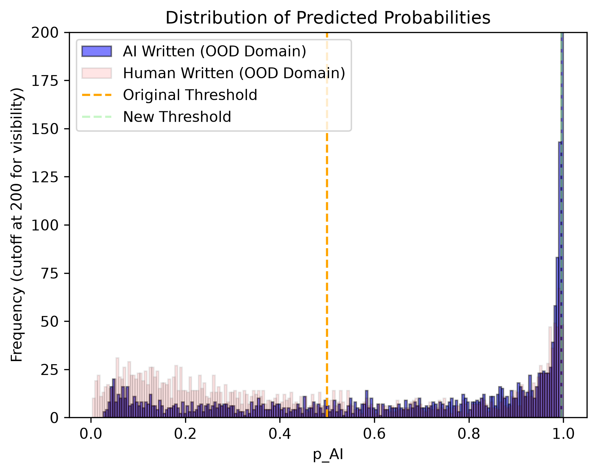

# margnap
`margnap` is a fine-tuned AI text classifier, atop the pretrained `distilbert-base-uncased` model, using distilbert-base-uncased tokeniser. The fine-tuning dataset used is the [`acmc/multi_domain_ai_human_text`](https://huggingface.co/datasets/acmc/multi_domain_ai_human_text) dataset. The classifier can be reproduced by running `notebook.ipynb`; for more details on my working, and how to best retrain, see below.

# Results

| Dataset | Accuracy (pre → post) | FPR (pre → post) | FNR (pre → post) |
|---|---|---|---|
| Validation | 88.70% → 88.16% | 18.16% → 0.96% | 4.44% → 22.72% |
| Test (in-domain) | 87.58% → 88.44% | 20.40% → 1.72% | 4.44% → 21.40% |
| CNN–Llama (OOD) | 89.44% → 99.05% | 21.04% → 1.10% | 0.08% → 0.80% |
| Adversarial: characters | 81.98% → 81.62% | 14.20% → 0.76% | 21.84% → 36.00% |
| Adversarial: paraphrase | 63.16% → 73.70% | 60.76% → 12.36% | 12.92% → 40.24% |
| Adversarial: words | 88.60% → 86.74% | 12.40% → 0.56% | 10.40% → 25.96% |
| OOD: domain | 66.96% → 62.92% | 42.12% → 1.36% | 23.96% → 72.80% |
| OOD: language | 68.16% → 59.10% | 16.36% → 0.00% | 47.32% → 81.80% |
| OOD: model | 78.80% → 81.38% | 29.44% → 2.72% | 12.96% → 34.52% |

# Process and Findings 

To build up my ML skills, I chose to train a simple classification model on detecting AI vs human text across multiple genres of writing and multiple families of LLM. To get started quickly, I checked Hugging Face for simple 'AI vs. Human' text datasets. Initially wary of a lack of dataset cards and README's, I decided to quickly go ahead with a large dataset with multiple different types of LLM content: [`ahmadreza13/human-vs-Ai-generated-dataset`](https://huggingface.co/datasets/ahmadreza13/human-vs-Ai-generated-dataset). I immediately noticed that (i) the data was imbalanced, with ~58% human written and 42% AI-written text (with further heavy weighting toward GPT4, and less toward e.g. Claude Opus 3 or Gemini 1.5 Pro), and (ii) the entirety of the human-written content was from Wikipedia, as this will have obvious stylistic differences from both AI-written and other human-written text. Furthermore, with no detailed data sourcing, there was no guarantee the Wikipedia content was not in part AI generated.

After tokenising with [`distilbert/distilbert-base-uncased`](https://huggingface.co/distilbert/distilbert-base-uncased), I chose to explore some properties of the dataset. Wikipedia articles are obviously much longer in length than other genres of writing like restaurant reviews, and the AI-written content seemed to span things like code, explanations, and letters, so this seemed like a sensible place to start. Indeed, whilst 0.01% of human-written content exceeded the max length of the model, the AI written content ranged from 2.62-58.95%, depending on the source LLM. 

On the 10% sized test dataset, the trained model achieved an accuracy of 99.90%, a FPR of 0.1046%, and a FNR of 0.0938%. Though I like to imagine I am a skilled data scientist, I am not hubristic enough to believe these results! Of course, the model is confounding the genres of writing in the different sources of data. Indeed, when testing on an OOD dataset of 50%/50% human-written vs. Llama-3.1-8B-written CNN articles ([`ilyasoulk/ai-vs-human-meta-llama-Llama-3.1-8B-Instruct-CNN`](https://huggingface.co/datasets/ilyasoulk/ai-vs-human-meta-llama-Llama-3.1-8B-Instruct-CNN)), the accuracy falls to 50.04%; random chance. 

The obvious error is in the training data. After searching more, I came across the [`acmc/multi_domain_ai_human_text`](https://huggingface.co/datasets/acmc/multi_domain_ai_human_text) dataset, with a much more diverse set of both human and AI-written text. Though there are still noticeable differences in token length (~23% of human data is greater than model max token length, vs. ~14% for AI data), the much broader set of sources will hopefully still overcome previous flaws. 

This 240k row dataset comprises a training set (~83.3%), validation set (~2.08%), a standard test set (~2.08%), and adversarial test sets: different LLMs, characters, paraphrasing, word choices/synonyms, domains, languages, each equal length (~2.08%).

Indeed, after training the model, evaluating on the same CNN-Llama dataset, I achieved an accuracy of 89.44%, a FPR of 21.04%, and a FNR of 0.08%. Despite the significant boost in performance, the FPR here is still, frankly, catastrophic. Given that AI detectors are typically being deployed in cases like academia for evaluating student essays, or when analysing [literary prize submissions](https://www.pangram.com/blog/ai-is-writing-prize-winning-fiction), the cost of falsely labelling human-written content as AI has a significant risk to severely impact the author of such work. 

As such, I chose to refine the probability threshold $p_{\text{AI}}$ to achieve an FPR of ≤ 1% on the validation set of the data; this is relatively low, whilst maintaining a TPR of 77.28%. That said, in a case of wide deployment, 1% is nothing to scoff at. Ideally, I'd like to achieve sub 0.01%, but this comes at too high of a cost of reducing the TPR to near uselessness with the current performance of the classifier.

Testing the same threshold on the CNN-Llama dataset, I see an accuracy of 99.05%, FPR of 1.10%, and FNR of 0.80%. The model is able to discriminate well between AI and human-written content (the ability to separate the classes at all), but the strong accuracy boost with the shift in threshold points to a calibration mismatch - there are still many human-written samples with a high $p_\text{AI}$, such that these probabilities can't be evaluated as literall "% chance AI", and are arbitrary scores, with a threshold set where classes separate more clearly. This is best demonstrated in the figure below, showing the $p_\text{AI}$ score for samples, split by whether they were actually human-written (in red) or AI-written (in blue).

On the test set of the original dataset, I achieve an accuracy of 88.44%, FPR of 1.72%, and an FNR of 21.40%. This FNR, whilst high, is much preferable to the case of falsely labelling human-written content as AI generated; punishing real work has much worse risk of doing harm than allowing some faults to pass through the cracks.

Performance is (expectedly) worse on the adversarial characters and paraphrasing sets, where accuracy falls by 10-20%, and the FNR rises to 36.00% and 40.24% respectively; in the paraphrase set, the FPR also spikes up to 12.36% -- this is the only adversarial set where the FPR rises so sharply. The OOD-domain dataset shows a different kind of failure to what was seen in the CNN case; we see that the model cannot discriminate as well in these adversarial datasets as the CNN case - there is much more muddling of AI and human-written content which is labelled as AI. As such, no threshold can properly recover performance. 

The worst performance comes in the case of the out-of-domain language dataset, where accuracy falls to a measly 59.10%.69%. Here, the FPR is a flat 0.00%, and the FNR reaches a poor 81.80% -- the model is coming to the conclusion that any non-English text is by default human generated, an obvious gap in the training data. This prompts an opportunity for better tuning using a more linguistically diverse training set.

I suspect some part of this worse performance on other languages may also stem from the tokenizer/base model, distilbert-base-uncased, being trained on English wikipedia and BookCorpus, leading to a heavy biasing towards the English language. Furthermore, using an uncased tokenizer may be leaving out some information which the detector could utilise in detections -- it's not hard to see how humans may make more or different mistakes in casing than LLMs. I intend to explore these as avenues to improve performance, along with looking for more, otherwise labelled data. I also intend to investigate whether the CNN dataset may have some overlap with the `acmc` human-AI dataset, as this would hamper its use in evaluation.

## Reproduction

I trained the model on my own RTX 4070 Super, with a learning rate of `2e-5` and 1 training epoch for the full run. Run `notebook.ipynb` to train - I suggest initialising with the first cell, then running everything after the "New Training Dataset" heading.

# AI usage

In this project, I used Claude to assist in bug-fixing and with helping me get more familiar with a few of the python libraries and arguments passed through, as well as in working with SSH and Git-signing to remotely work from my laptop while on holiday. I find it extremely important to ensure the work I do, choices I make, and conclusions I come to are my own; I can't learn if I don't make my own mistakes and evaluate them. Dataset choices, evaluation choices, training parameter choices, were all my own. 